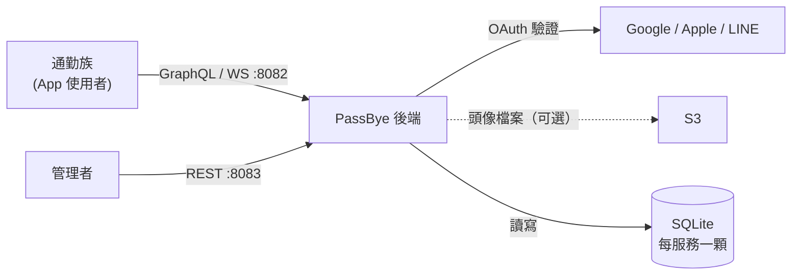
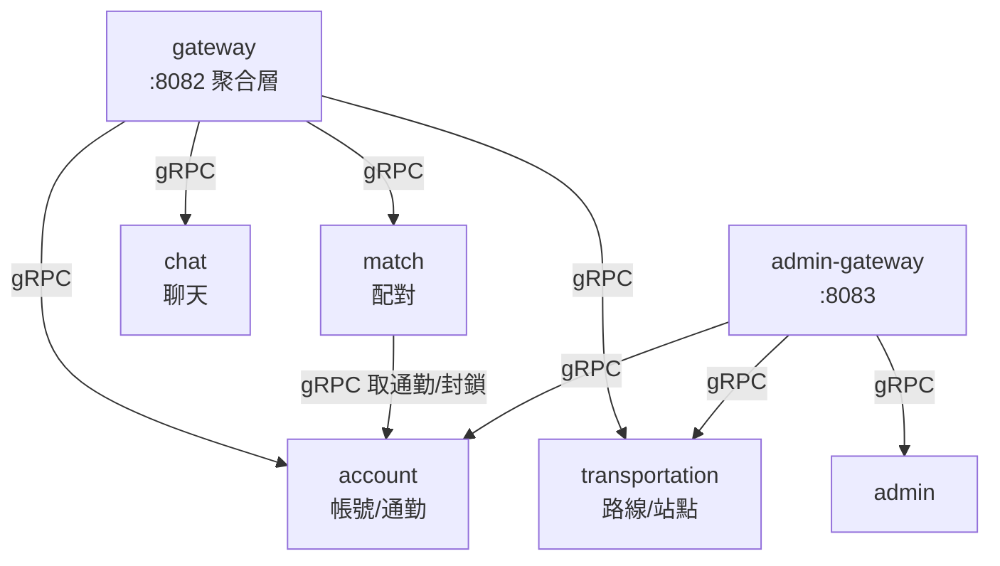
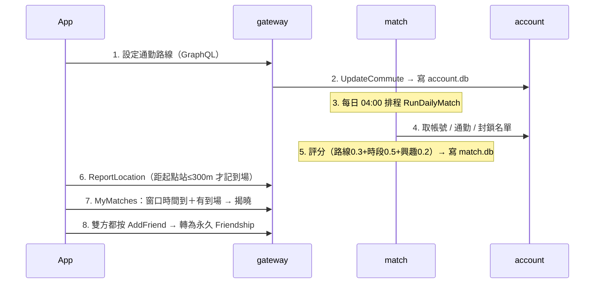

# PassBye 架構圖

> 2026-07-06 由 Fable 5 撰寫，作為 /archmap 的黃金範例。三層圖 + 每圖 ≤5 行說明 + 白話版。
> 節點路徑對照表在檔尾；箭頭方向 = 呼叫方向。

## L1 系統上下文

- 沒有外部即時交通 API：站點資料是離線 JSON 種子（tools/seeder），不需要 TDX 金鑰。
- C 端（8082）與管理端（8083）是兩個獨立的門，權限體系互不相通。
- 檔案儲存預設寫本機 `./data/uploads`，S3 是用 `storage.backend` 設定切換的備選，所以畫虛線。
- 同一份碼有三種部署形態：單容器 all-in-one（Railway/Render）、compose 多容器、k8s。

## L2 模組圖（服務與 gRPC 依賴）

- 微服務形、但每服務一顆獨立 SQLite——跨服務資料**只能走 gRPC，不能 join**，這是改功能時最常撞的牆。
- match → account 是唯一的服務間橫向呼叫（配對演算法要拿帳號、通勤、封鎖名單）；account / transportation / chat 是葉節點。
- 開發時 `cmd/all-in-one` 把全部服務用 fx 拼進同一個 process；根目錄的 `main.go` / `modules.go` 是**過時遺留**，不要從那裡追碼。

## L3 關鍵流程：每日配對到交友

- 配對是**批次**不是即時：每天 04:00 跑一次；開發時用 `POST /dev/run-matching` 手動觸發。
- 揭曉是**雙閘門**：聊天窗口時間到、且當日有到場紀錄，兩者都成立才看得到對方——測試時最容易誤判成 bug 的地方。
- 好友轉換要雙方都按，單方按了狀態不變。

## 白話版

PassBye 是給每天固定通勤的人交朋友的 App：你設定平常搭車的路線和時段，系統每天清晨把順路又合拍的人配成一對。配對不會馬上公開——要到了通勤時段、而且你人真的在車站附近，才會揭曉今天的緣分。兩個人都願意加好友，一日緣分就變成永久好友，可以一直聊下去。登入用 Google、Apple 或 LINE 帳號，資料存在各個小服務自己的資料庫檔案裡。最怕壞的兩個地方：配對排程掛了，隔天所有人都沒有新配對；帳號服務掛了，連登入都進不來。

## 節點 → 路徑對照表

| 節點 | 路徑 |
|---|---|
| gateway | services/gateway/（GraphQL：pkg/graphql_server/，揭曉閘門：pkg/graphql_server/presence.go） |
| admin-gateway | services/admin-gateway/ |
| account | services/account/（OAuth：pkg/account_manager/oauth.go） |
| transportation | services/transportation/ |
| match | services/match/（演算法：pkg/match_manager/core.go，排程：pkg/match_manager/scheduler.go） |
| chat | services/chat/ |
| admin | services/admin/ |
| SQLite 連線 | services/*/pkg/database/module.go |
| S3 / 本機儲存 | services/gateway/pkg/storage/ |
| 種子資料 | tools/seeder/ |
| all-in-one 入口 | cmd/all-in-one/main.go |
| 部署 | Dockerfile（單容器）、deploy/docker-compose.yml、deploy/k8s/ |
